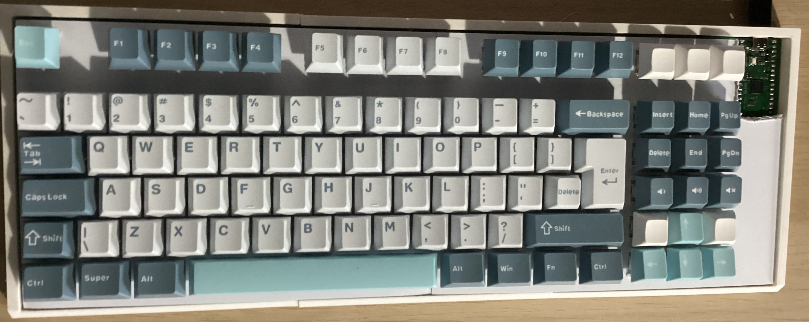
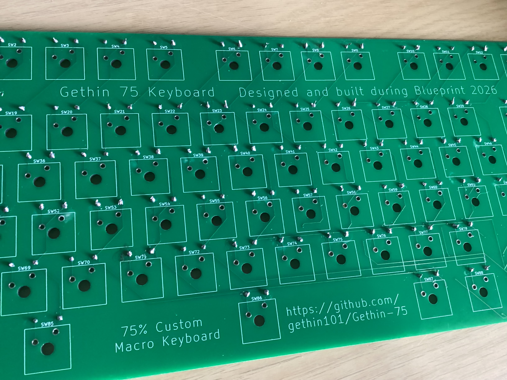
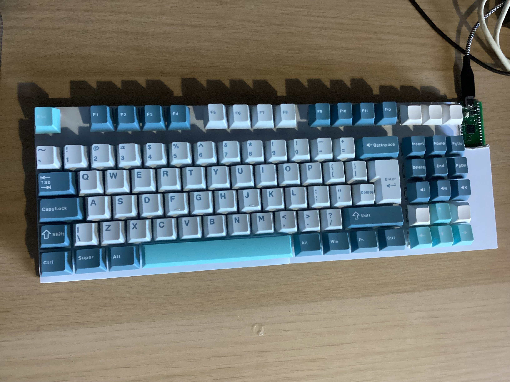
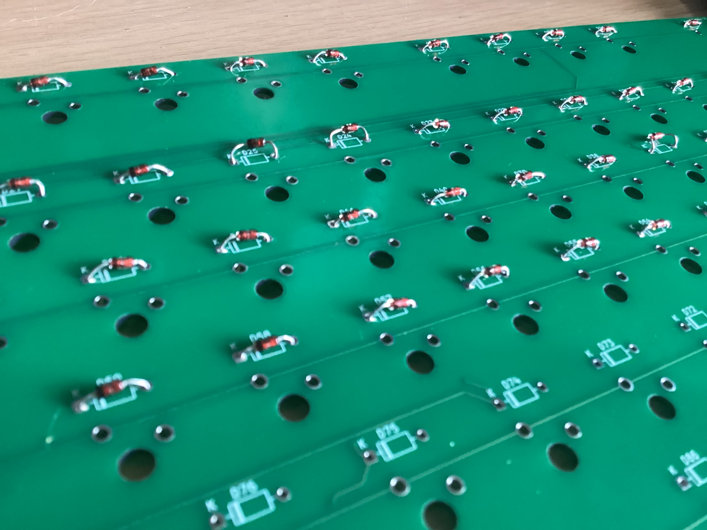
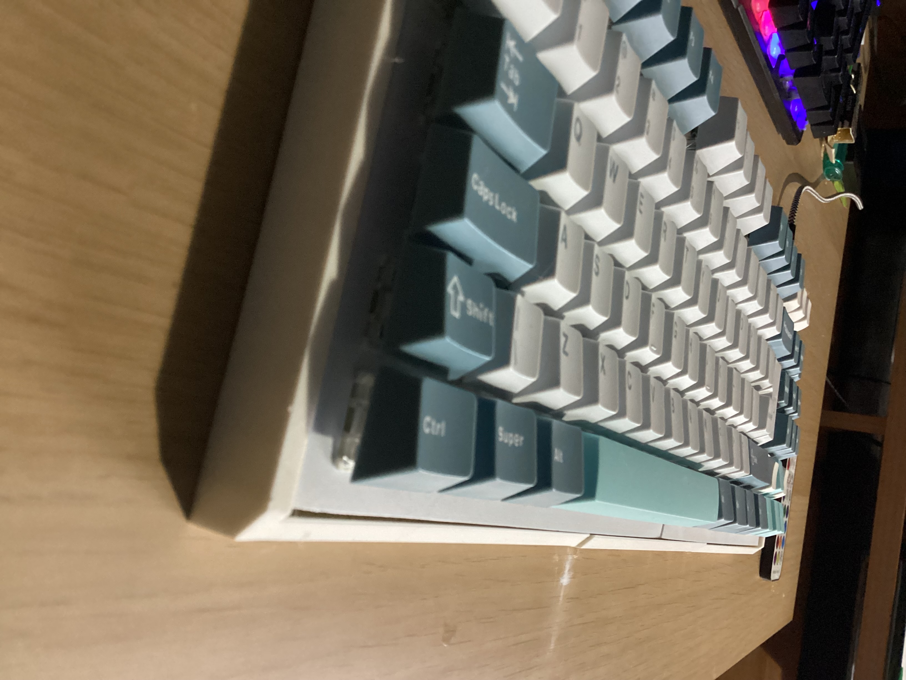
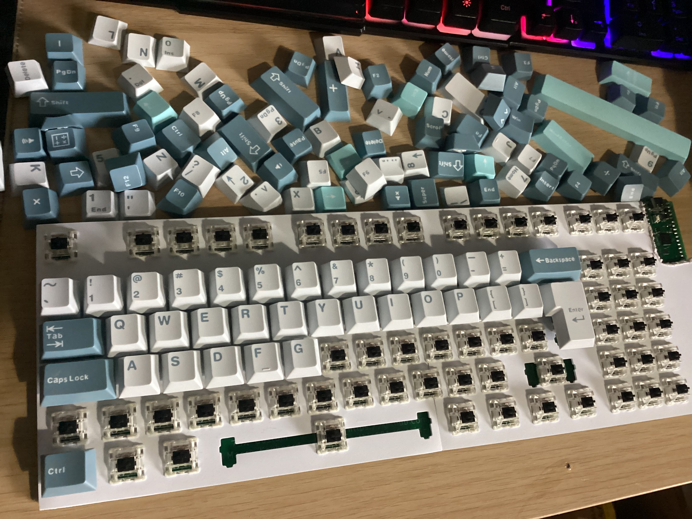
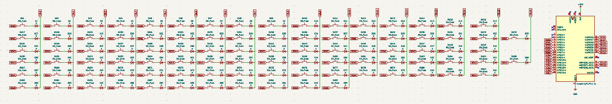

# Gethin-75 
A custom 75% mechanical keyboard with macro keys powered by a Raspberry pi pico and KMK firmware that I designed and built during Hackclub's Blueprint program - [project link](https://blueprint.hackclub.com/projects/12386)

I made this project to learn the fundamentals of how keyboards and macropads work, to improve my PCB design skills by learning how switch matrixes work and to get more familiar with modelling parts in CAD for 3D printing.

   

  <a href="#BOM">BOM</a> •
  <a href="#Images">Images</a> •
  <a href="#Firmware">Firmware</a> •
  <a href="#Full-Wiring-Table">Wiring</a> •
  <a href="#Keys">Keys</a> •
  <a href="#Stabilizers">Stabilizers</a> 

# Key Features
- **93 programmable macro keys**
- **Custom 2-layer PCB**
- **Powered by a Raspberry Pi Pico**
- **Custom KMK firmware**
- **Simple USB connectivity**
- **Inter-changable Cherry MX key switches**
- **3D printed case & plate**
- **Rubber feet pads for stability**
- **Easy assembly with no screws**

# Build
| Final Build | PCB |
|-------------|-----|
|  |  |
|  |  |
|  |   |

# Design Images
Here, you can see my KiCad schematic, PCB layout and 3D model of my PCB. On the right, you can see my keyboard bottom case I modelled in Fusion 360 as well as my custom plate and an assembly image.
 

Click to see schematic

Click to see PCB

Click to see 3D PCB

**Click any of the images below or click above to see it in more detail**

| PCB | CAD |
|-----|-----|
|  |  |
|  |  |
|  |  |

Click to see case model

Click to see plate model

Click to see keyboard assembly

 

 # Full Wiring Table

Click to see full wiring table

 

| Net   | GPIO | Notes   |
|-------|------|---------|
| ROW0  | GP2  | Matrix  |
| ROW1  | GP3  | Matrix  |
| ROW2  | GP4  | Matrix  |
| ROW3  | GP5  | Matrix  |
| ROW4  | GP6  | Matrix  |
| ROW5  | GP7  | Matrix  |
| COL0  | GP8  | Matrix  |
| COL1  | GP9  | Matrix  |
| COL2  | GP10 | Matrix  |
| COL3  | GP11 | Matrix  |
| COL4  | GP12 | Matrix  |
| COL5  | GP13 | Matrix  |
| COL6  | GP14 | Matrix  |
| COL7  | GP15 | Matrix  |
| COL8  | GP16 | Matrix  |
| COL9  | GP17 | Matrix  |
| COL10 | GP18 | Matrix  |
| COL11 | GP19 | Matrix  |
| COL12 | GP20 | Matrix  |
| COL13 | GP21 | Matrix  |
| COL14 | GP22 | Matrix  |
| COL15 | GP26 | Matrix  |
| COL16 | GP27 | Matrix  |
| 3V3   | +3v3 | Pico    |
| GND   | GND  | Common  |

 
# Firmware
I have written my custom keyboard code in CircuitPython using KMK to control the keystrokes and I have made a macro handler at the start that means I can change the function of any of my keys whenever I want.

My macro keys at the moment:
- Previous song
- Play / Pause
- Next song
- Volume down
- Volume up
- Lock
- File Explorer
- Task Manager

**Setup:**
- Flash [CircuitPython](/Firmware/adafruit-circuitpython-raspberry_pi_pico2-en_GB-10.1.3.uf2) onto my pico
- Download KMK from [Github](/Firmware/kmk) and copy to root
- Download [code.py](/Firmware/code.py) onto the pico

# Keys
My keyboard is a 75% keyboard with a total of 93 keys - 85 normal and 8 custom macro keys.

Here is the link to my [keyboard layout](https://www.keyboard-layout-editor.com/#/gists/a3df558aee879b924d336356534e8c5d)  

---

# BOM
| Qty | Item | Notes | Cost (£) | USD ($) | Link |
|------|-----|-------|----------|---------|------|
| 100 | MX-Style key switches | Black 100pcs | £21.49 | $28.68 | [AE](https://www.aliexpress.com/item/1005006091988869.html?spm=a2g0o.productlist.main.7.75c58gJx8gJxPL&algo_pvid=9ce49efa-7e7f-4084-9907-27c06cf10fb0&algo_exp_id=9ce49efa-7e7f-4084-9907-27c06cf10fb0-6&pdp_ext_f=%7B%22order%22%3A%22835%22%2C%22spu_best_type%22%3A%22price%22%2C%22eval%22%3A%221%22%2C%22fromPage%22%3A%22search%22%7D&pdp_npi=6%40dis%21GBP%214.28%210.75%21%21%2138.69%216.78%21%40211b613917718647541901282e256e%2112000035698597722%21sea%21UK%210%21ABX%211%210%21n_tag%3A-29910%3Bd%3Ac7b67d0a%3Bm03_new_user%3A-29895%3BpisId%3A5000000197842856&curPageLogUid=NyDkJsY5AIXg&utparam-url=scene%3Asearch%7Cquery_from%3A%7Cx_object_id%3A1005006091988869%7C_p_origin_prod%3A)
| 126 | Cherry MX Key caps | Yunhu White | £5.49 | $7.33 | [AE](https://www.aliexpress.com/item/1005007321700850.html) |
| 1 | Raspberry Pi Pico | USB C | £1.93 | $2.58 | [AE](https://www.aliexpress.com/item/1005006054409042.html) |
| 5 | Plate-mount stabilizers | 4x 2u and 6.25u | £4.29 | $5.79 | [AE](https://www.aliexpress.com/item/1005002552011081.html?spm=a2g0o.detail.similar_items.1.74c544gP44gPGi&utparam-url=scene%3Aimage_search%7Cquery_from%3Adetail_bigimg%7Cx_object_id%3A1005002552011081%7C_p_origin_prod%3A&algo_pvid=5eb5f0e8-483f-4e53-bf91-23823326ba18&algo_exp_id=5eb5f0e8-483f-4e53-bf91-23823326ba18&pdp_ext_f=%7B%22order%22%3A%229%22%2C%22fromPage%22%3A%22search%22%7D&pdp_npi=6%40dis%21GBP%215.64%214.29%21%21%217.36%215.60%21%40211b655217724376724172627e1aeb%2112000021107331951%21sea%21UK%210%21ABX%211%210%21n_tag%3A-29910%3Bd%3Ac7b67d0a%3Bm03_new_user%3A-29895) |
| 100 | 1N4148 diodes | Through-hole | £0.89 | $1.19 | [AE](https://www.aliexpress.com/item/4001126137167.html?spm=a2g0o.productlist.main.1.90b1o1uho1uh6B&algo_pvid=c367e696-c97b-45f9-aadc-442c0813800d&algo_exp_id=c367e696-c97b-45f9-aadc-442c0813800d-0&pdp_ext_f=%7B%22order%22%3A%221197%22%2C%22eval%22%3A%221%22%2C%22fromPage%22%3A%22search%22%7D&pdp_npi=6%40dis%21GBP%210.89%210.76%21%21%211.16%210.99%21%402103894417717723958752301e1008%2110000014629985518%21sea%21UK%210%21ABX%211%210%21n_tag%3A-29910%3Bd%3Ac7b67d0a%3Bm03_new_user%3A-29895%3BpisId%3A5000000197842856&curPageLogUid=KHdyO7FyLrgo&utparam-url=scene%3Asearch%7Cquery_from%3A%7Cx_object_id%3A4001126137167%7C_p_origin_prod%3A) |
| 50 | Rubber feet pads | 13x5.5mm | £0.76 | $1.02 | [AE](https://www.aliexpress.com/item/1005006832476105.html) |
| 5 | Custom PCB | Gerber quote | £14.37 | $19.22 | [JLCPCB]([https://www.aliexpress.com/item/1005006832476105.html](https://jlcpcb.com/)) |
| 2 | 3D Print case and plate | #printing-legion (estimate) | £8 | $10.68 | [N/A](www.github.com/gethin101) |
| 0 | Shipping (will refund if extra) | Told to put this | £10 | $13.37 | [Slack](https://hackclub.enterprise.slack.com/archives/C083P4FJM46) |
| **390** | **Total cost:** | **May vary slightly** | **£70.69** | **$94.49** | [BOM](/Bom.csv) |

**Please note that I was told to add an extra estimate for shipping costs as well as the printing legion costs that I will return to HQ if not used**

**Also lots of the AliExpress prices have been fluctuating up and down but I have just put down the current prices for my BOM**

# Cart Screenshots

Click to expand cart screenshots

# Stabilizers 

My spacebar, left shift, right shift, enter and backspace all need MX stabilizers as they are above 2u and these will be plate-mounted.

| Key | Size | Stabilizer |
|-----|------|------------|
|Space| 6.25u| 6.25u plate-mount |
|R-Shift| 2.75u | 2u plate-mount |
|Enter | 2.25u | 2u plate-mount |
|Backspace | 2u | 2u plate-mount |

---

# Blueprint requirements

- [✅] A short description of what your project is  
- [✅] A couple of sentences on how to use your project  
- [✅] A couple of sentences on why you made the project  

- [✅ ] Screenshot of a full 3D model of your project  
- [✅ ] Screenshot of your PCB (if applicable)  
- [✅ ] Wiring diagram (if any wiring is not on a PCB)  
- [✅] Bill of Materials (BOM) in table format at the end of the README, with links [BOM](/BOM.csv)

- [✅] Fully original, customized design (not a direct copy of any guide)  
- [✅] Complete CAD assembly including all components (electronics included)  
- [✅] Firmware present (even if untested)  
- [✅] Design sanity‑checked with someone else  [(checked by @krunch)](https://hackclub.enterprise.slack.com/team/U0828MFCD99) + preliminary approved by [@shadow](https://hackclub.enterprise.slack.com/team/U09V9HPQAMD)

- [✅] BOM in CSV format in the root directory, with links  
- [✅] PCB source files (.kicad_pro, .kicad_sch, gerbers.zip, etc.) if applicable  
- [✅] A .STEP file of the full 3D CAD model including electronics  
- [✅] Source CAD files (.f3d, .FCStd, etc., or OnShape public link in README)  
- [✅] All other project files included (firmware, libraries, references, etc.)  
- [✅] Repository organized into readable, logical folders  

> ⚠️ **Important:** Missing a complete .STEP file with all electronics and CAD will result in project rejection. ✅

Designed and built by [@gethin101](https://github.com/gethin101)

